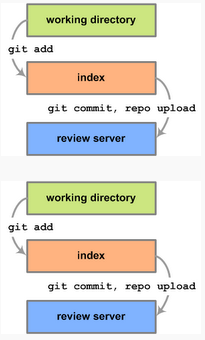
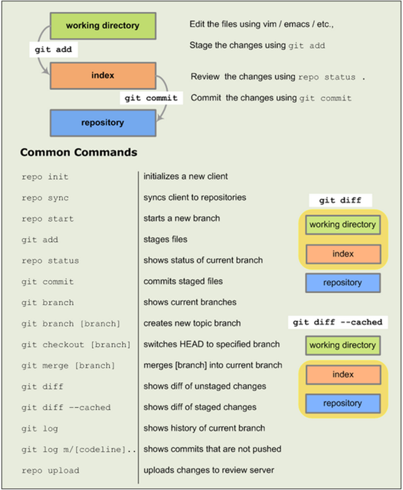

# 开发

应用 Android 代码时，你需要同时使用 Git 和 Repo，在大多数情况下，你可以使用 Git 而不是 Repo，或是混合使用 Git 和 Repo 形成的复杂命令。然而，把 Repo 使用于基本跨网络（across-network）的操作时，将会使你的工作更加简单。  

**Git** 是一个开源的版本控制系统，设计来处理分布在多个存储库的大项目。在 Android 背景中，我们可以使用 Git 进行本地操作，如本地分支，提交，差异，和编辑。其中我们在建立 Android 项目所面临的其中一个挑战就是如何最好地支持外界社区——从爱好社区到大型 OMEs 构建大众消费设备。我们希望组件能够被替换，我们还想要有趣的组件去发展他们在 Android 以外的生活。我们首先选择一个分布式的版本控制系统，然后进一步将其缩小到 Git。

**Repo** 是我们建立在 Git 顶部的一个存储库管理工具。Repo 在必要时可以统一许多个 Git 仓库，上传到我们的 [版本控制系统](https://android-review.googlesource.com/#/q/status:open)，并且自动化 Android 部分开发工作流程。Repo 并不意味着取代 Git，只是帮助更容易地在 Android 环境中使用 Git。Repo 命令是一个可执行的 Python 脚本，你可以把它放在你的任何路径上。在使用 Android 源文件工作时，你将把 Repo 使用于跨网络操作。例如，使用一个单一的 Repo 命令，你就可以从多个存储库下载文件到你的本地目录下。

**Gerrit** 是一个基于 Web 的代码审查系统，使用的是 Git。Gerrit 鼓励所有授权用户更多的集中使用 Git 来提交变化，如果他们发布代码审查，Gerrit 将可以进行自动合并。此外，Gerrit 通过浏览器显示每一步变化使审查变得更加容易，并且支持内联注释。

## 基本工作流程

与存储库交互的基本模式如下：

1. 使用 `repo start` 开始一个新的主题分支。
2. 编辑文件。
3. 使用 `git add` 暂存更改。
4. 使用 `git commit` 提交更改。
5. 使用 `repo upload` 上传更改到审查服务器。 

  

## 任务参考

下面的任务列表总结了如何进行普通的 Repo 和 Git 任务操作。关于使用 Repo 下载资源的信息，请参阅 [下载资源](download-source.md) 和 [使用 Repo](using-repo.md)。

## 同步你的客户端

同步所有可用项目的文件：  

    $ repo sync
 

同步已选择项目的文件：  

    $ repo sync PROJECT0 PROJECT1 PROJECT2 ...
 

## 创建主题分支

当你开始进行一个改变时，在你的本地工作环境上新建一个主题分支，例如当你开始解决 bug 或开发新功能的时候。主题分支不是原始文件的复制；它是一个特定的提交的指向。这使得创建的本地分支能在它们之间进行轻微操作的切换。通过使用分支，你可以把当前的工作与其他工作分离。有关使用主题分支的一篇有趣的文章，请参阅 [分离特性分支](https://www.kernel.org/pub/software/scm/git/docs/howto/separating-topic-branches.txt)。  

使用 Repo 开始一个主题分支，导航到该项目进行修改和发布：  

    $ repo start BRANCH_NAME .  

请注意，这个期间是在当前工作目录下。验证是否已创建新的分支：  

    $ repo status .
  

## 使用主题分支

要指定分支到一个特定的项目：  

    $ repo start BRANCH_NAME PROJECT_NAME

查看 [android.googlesource.com](https://android.googlesource.com/) 所有项目的列表。此外，如果你已经导航到特定项目的目录，那么你可以简单地传递一个时期代表当前项目。  

要切换到您在本地工作环境中创造的另一个分支：  

    $ git checkout BRANCH_NAME

查看现有分支的列表：  

    $ git branch

或  

    $ repo branches

当前分支的名字将被标星号表示优先。

>注意：一个 bug 可能会导致 `repo sync` 重置本地的分支。如果你运行 `repo sync` 之后， `git branch` 显示 *（没有分支），那就再次运行 `git checkout`。

## 暂存文件

默认情况下，Git 通知但没有跟踪你在一个项目中所做的更改。为了让 Git 保存你的更改，你必须将它们标记在一个 commit 中。这也称之为 “staging（暂存）”。  

你可以在运行下面命令来暂存更改

    git add

它接受作为参数的项目目录中的任何文件或目录。尽管 `git add` 并不如名字表示的这样简单地将文件添加到 Git 仓库，但是它也是可以用来暂存文件的修改和删除的。  

## 查看客户端状态

列出文件的状态：  

    $ repo status

查看未提交的编辑：  

    $ repo diff  

 `repo diff` 命令能够显示你所做的每一个本地编辑，除了已经进入提交的，如果你正准备现在提交。如果你现在提交，那么你将进入提交并且可以看到每一个编辑状态，你需要一个 Git 命令，即 `git diff` 。运行它之前，首先确定你是在当前项目的目录下：  

    $ cd ~/WORKING_DIRECTORY/PROJECT  
    $ git diff ——cached

## 提交更改

在 Git 中，一个 commit 是版本控制的一个基本单位，是组成目录结构的一个快照（snapshot），也是组成整个项目的文件内容。在 Git 中创建一个 commit 很简单，只需要输入如下代码：  

    git commit

你将在你最喜欢的编辑器中收到一条 commit 消息的提示；请为你提交到 AOSP 的更改都提供一条有效信息。如果你*不*添加记录信息，你的 commit 将会被中止。

## 上传更改到 Gerrit 

上传之前，更新到最新版本：

    repo sync  

然后运行

    repo upload

这将会把你已经提交的更改列表出来，并且提示你选择分支上传到审查服务器。如果只有一个分支，那么你会看到一个简单的 `y/n` 提示。

## 恢复同步冲突

如果一个 `repo sync` 显示同步冲突：

-  查看拆分的文件（status code = U）。
-  必要时编辑冲突区域。
-  在相关的项目目录中更改，为上述文件运行 `git add` 和 `git commit`，然后 “rebase” 这个更改。例如：
       
    ```
    $ git add .        
    $ git commit   
    $ git rebase --continue  
    ```   
    
- 当 rebase 完成时再一次开始完整的同步：
   
    ```  
    $ repo sync PROJECT0 PROJECT1 ... PROJECTN
    ```

## 清理你的客户端文件

更改被合并到 Gerrit 之后更新你的本地工作目录：

    $ repo sync

安全的移除已过时的主题分支：

    $ repo prune

## 删除客户端

因为所有暂存文件都存储在你的客户端，你只需要从你的文件系统直接删除目录：

    $ rm -rf WORKING_DIRECTORY

删除客户端将会*永久地删除*你还没有上传审查的更改。

## Git 和 Repo 备忘录




